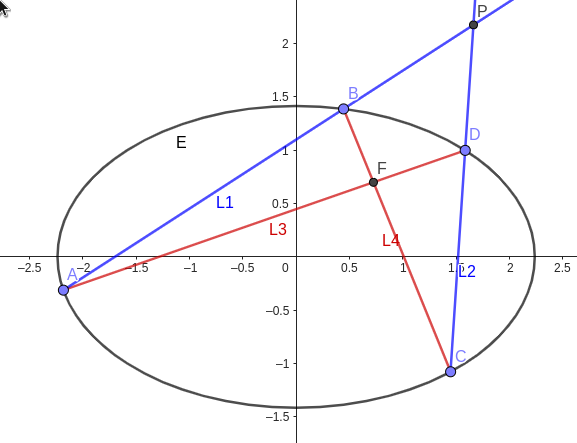
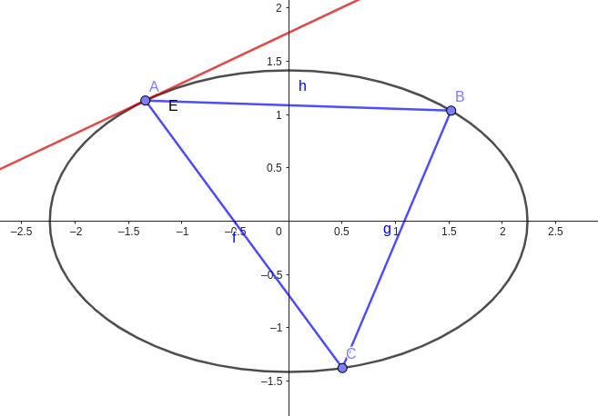
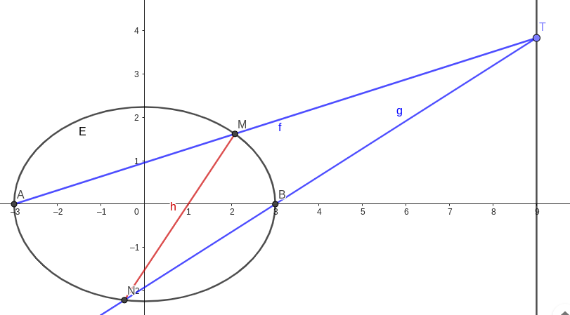

# 曲线系

> 曲线系仅仅是一种避免求交点的, 很自然的想法.

## 子集: 直线系

设两条直线为 $l_1, l_2$, 

**"交集"**: 

$$
l_1 + \lambda l_2 = 0,
$$

一方面表示 $l_1$ 与 $l_2$ 交点, 
另一方面表示过交点的所有直线 (不包括 $l_2$, 这一点可以联想直线的斜截式).

> 交点也就是"交集".

**"并集"**:

$$
l_1 \times l_2 = 0, 
$$

表示两个直线上面所有的点.

> 所有点就是"并集".

**注意到**, $l_1 \times l_2$ 实际上提高了方程的次数, 实际将其转化为了二次曲线.

实际上, $l_1l_2$ 是退化的双曲线方程!

## 常见例子: 渐近线

$$
H: \dfrac{x^2}{a^2} - \dfrac{y^2}{b^2} = 1, 
$$

将右侧 $1$ 变为 $0$ 即为 $H$ 渐近线.

> 两条直线就是退化的二次曲线.

## 二次曲线

$$
Ax^2+2Bxy+Cy^2+2DX+2Ey+F = 0,
$$

表示?: 椭圆(圆), 双曲线, 抛物线, **两条直线**.

## 现在开始: 曲线系!

这是什么?

先告诉你, $E$ 可以被这样表示:

$$
L_1L_2 + \lambda L_3L_4 = \mu E,
$$

将它与我们前面所学的直线系相关联, 你想到了什么?

没错, 实际上 $L_1L_2$ 和 $L_3L_4$ 都是二次曲线, 而上面的方程则表示了过这两个二次曲线的公共点的所有二次曲线!(当然, 这里也不包括 $L_3L_4$, 但这在一般情况并无大碍).

为什么有 $\mu$? 实际上, 上面的方程原来被写成这样:

$$
\lambda L_1L_2 + \mu L_3L_4 = E, 
$$

现在能理解了吧.

那下面的椭圆又该如何表示呢?

$L_1L_2$, $L_2L_3$ 和 $L_3L_1$ 为分别的三个二次曲线, 而 $E$ 过这三个二次曲线的公共点(抱歉这里直线没改名字).

那么就可以这么表示:

$$
L_1L_2 + \lambda L_2L_3 + \mu L_3L_1 = kE.
$$

## 来几道例题吧

很经典的题, 对吧, 已经成各种tricks试验场了(bushi).

$T$ 坐标为 $(9, m)$, $A, B$ 为 $E$ 左右顶点, 再交于 $M, N$, 求 $MN$ 过定点.

等等, 先把你的齐次化收一收(.

根据我们上面的思路, 直接把 $E$ 用曲线系重新表示, 然后对比系数.

$$
\boldsymbol{I}
\begin{cases}
    AT: x = 12/m-3, \\
    BT: x = 6/m+3
\end{cases},\boldsymbol{II}
\begin{cases}
    AB: y = 0, \\
    MN: y = kx + n (这里设一个)
\end{cases}
$$

然后呢, 

$$
\boldsymbol{I} + \lambda \boldsymbol{II} = \mu E, 
$$

代入就是下面这个样子, 

$$
\left(x-\dfrac{12}{m}y+3\right)\left(x-\dfrac{6}{m}y-3\right)+\lambda y\left(kx-y+n\right) = \mu \left(\dfrac{x^2}{9}+\dfrac{y^2}{5}-1\right)
$$

不难发现实际上我们只需要关注带 $k$ 及 $n$ 的项就行了, 在这里即 $xy$ 及 $y$ 项.

故有, 

$$
\begin{cases}
    -\dfrac{12}{m}-\dfrac{6}{m}+\lambda k = 0, \\
    \dfrac{36}{m}-\dfrac{18}{m}+\lambda n = 0
\end{cases}
$$

对比系数有 $n = -k$, 即直线 $MN$ 可以被表示为

$$
MN: y = kx-k, 
$$

故 $MN$ 过定点 $(1, 0)$!
